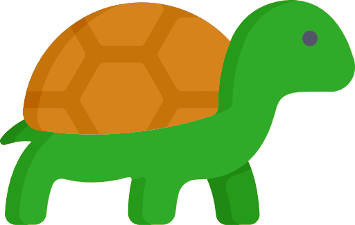
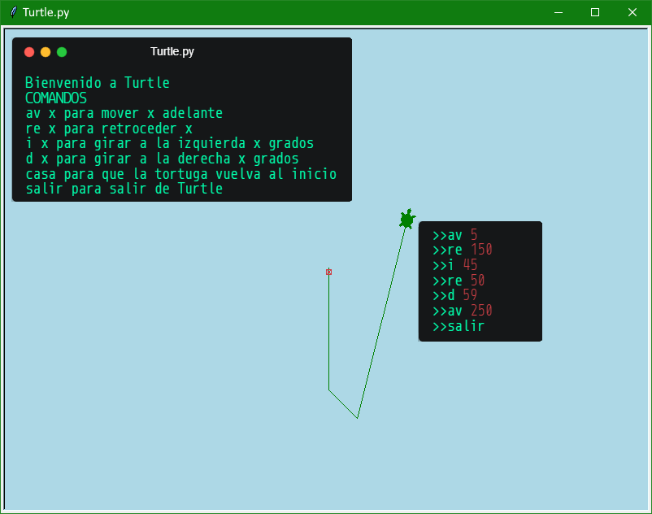
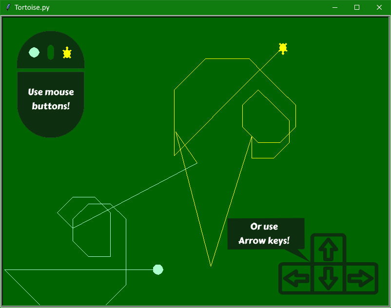

<p align="center">
  <a href="" rel="noopener">
 </a>
</p>

<h3 align="center">Tortuga</h3>

<div align="center">

[](https://www.python.org/)

</div>

<p align="center"> Desafío para aprender interfaces gráficas con Python3.
    <br> 
</p>

## 📝 Contenidos

- [¿Qué es Tortuga?](#about)
- [¡Empecemos!](#getting_started)
- [Iniciar los proyectos](#usage)
- [Tecnologías usadas](#built_using)
- [Autores](#authors)
- [Agradecimientos](#acknowledgement)

## 🧐 ¿Qué es Tortuga? <a name = "about"></a>

Tortuga es un par de proyectos que utilizan la biblioteca [Turtle](https://docs.python.org/3/library/turtle.html) de Python3.

## 🏁 ¡Empecemos! <a name = "getting_started"></a>

### Turtle

<p align="center">
  <a href="./Turtle.py" rel="noopener">
 </a>
</p>

Con **Turtle** tendrás que ir escribiendo las instrucciones **en una consola externa**, paralelamente irás viendo los movimientos en la ventana principal.

### Tortoise

<p align="center">
  <a href="./Tortoise.py" rel="noopener">
 </a>
</p>

Con **Tortoise** tendrás que ir **Clickeando en la misma pantalla principal**, ambos botones del _mouse_ además de las teclas de flecha te permitirán moverte.

### Requisitos Previos

Instalar [Python3](https://www.python.org/).

## 🎈 Iniciar los proyectos <a name="usage"></a>

```
python Turtle.py

python Tortoise.py
```

## ⛏️ Tecnologías usadas <a name = "built_using"></a>

- [Python](https://www.python.org/) - Lenguaje de programación.

## ✍️ Autores <a name = "authors"></a>

- Enzzo - Creación del archivo Turtle.
- [@Marfullsen](https://github.com/Marfullsen) - Creación del archivo Tortoise.

## 🎉 Agradecimientos <a name = "acknowledgement"></a>

- Enzzo Igor.